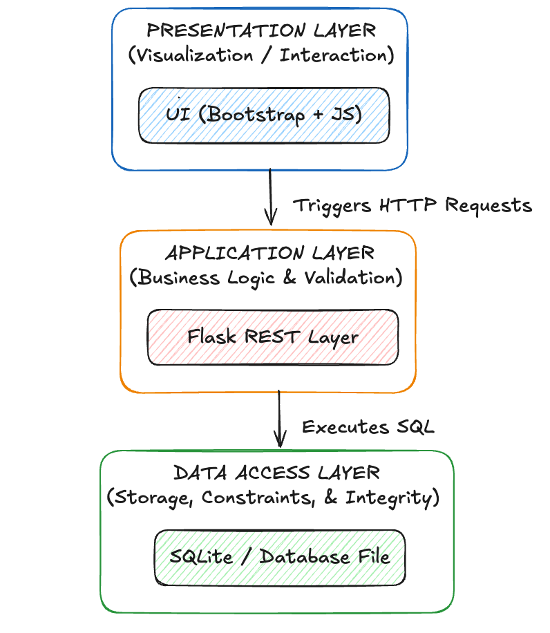

# Personal Kanban


**Personal Kanban** is a lightweight, privacy-focused desktop application for managing tasks. Built with **Flask** and **PyWebView**, it combines the power of a web interface with the convenience of a native desktop app. All data is stored locally on your machine, ensuring your plans remain private.


## Key Features

### Product & UX

* **Native Desktop Experience:** Packaged via PyInstaller using Flask + PyWebView (no browser dependency).
* **Kanban Workflow:** Drag-and-drop tasks between *Backlog*, *Requested*, *In Progress*, and *Done*.
* **Subtasks & Progress Tracking:** Checklist completion automatically computes task‑level progress.
* **Project‑Based Segmentation:** Tag‑driven filtering enables structured task grouping.
* **Project Management:** Filter tasks by project with a dynamic tag system.
* **Archive System:** Archive completed tasks to keep your board clean without losing history.
* **Visual Priority:** Distinct visual cues for High, Medium, and Low priority tasks.

### Data & Enginering: 

* **Relational Data Storage:** SQLite-backed persistence for tasks, subtasks, projects, and priorities.
* **Clear Data Access Layer:** Centralized CRUD operations to ensure consistency.
* **Local Persistence:** Data stored outside the application bundle to survive rebuilds.
* **Automated Tests:** Pytest coverage for API endpoints and database logic.
* **Reproducible Builds:** One-command packaging for macOS and Windows.y.


## Technical Architecture

This separation mirrors production analytics systems:




* **Presentation Layer** → Visualization / interaction
* **Application Layer** → Business logic & validation
* **Data Layer** → Storage, constraints, and integrity

## Project Structure

```text
.
├── web.py                 # Application entry point (Flask + PyWebView logic)
├── db.py                  # Database schema and CRUD operations (SQLite)
├── deploy.sh              # Script to build the standalone executable
├── launch.sh              # Helper script to run dev mode
├── requirements.txt       # Python dependencies
├── templates/
│   └── index.html         # Single-page application frontend (Bootstrap + JS)
├── auxiliar/
│   └── app.icns           # Application icon
└── tests/                 # Pytest suite
    ├── test_api.py
    └── test_db.py
```
## Installation & Development

1. Clone the repository

    ```
    git clone [https://github.com/yourusername/personal-kanban.git](https://github.com/yourusername/personal-kanban.git)
    cd personal-kanban
    ```
2. Set up a Virtual Environment

    ```
    python -m venv .venv
    source .venv/bin/activate  # On Windows use: .venv\Scripts\activate
    ```

3. Install Dependencies

    ```
    pip install -r requirements.txt
    ```
4. Run in Development Mode

    You can run the app directly using the helper script:

    ```
    ./launch.sh
    ```
    Or manually:

    ```
    python web.py
    ```

## Building the Executable
To package the application as a standalone .app (macOS) or .exe (Windows), use the provided deploy script. This uses PyInstaller.

    ./deploy.sh

The executable will be generated in the dist/ folder.

- macOS: dist/Personal Kanban.app
- Windows: dist/Personal Kanban.exe

## Data Storage
The application stores your data in a simple SQLite database file located in your home directory to prevent data loss during updates or rebuilds.

- **Location**: ~/kanban_board.db (User Home Directory)

## Testing
The project includes a test suite using pytest to ensure API and Database stability.

    # Run all tests
    pytest tests/

## License
Distributed under the MIT License. See LICENSE for more information.